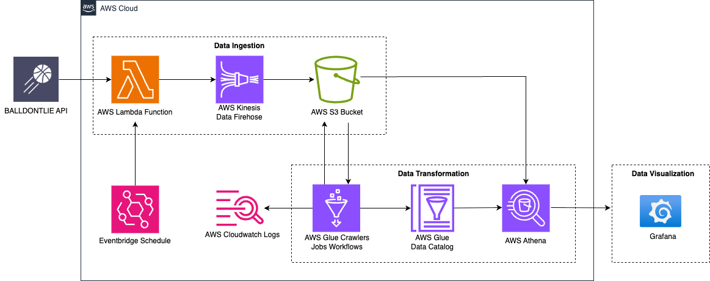

# NBA Playoffs Data Pipeline (Serverless AWS)

This project implements a **serverless data engineering pipeline** on AWS, ingesting, transforming, and visualizing NBA Playoffs player, team, and game stats. It demonstrates end-to-end data automation - from real-time ingestion with Lambda and Firehose, to transformation with Glue, and analysis in Athena and Grafana.

---

## Table of Contents

- [Architecture Overview](#architecture-overview)
- [Data Ingestion](#data-ingestion)
- [Data Transformation](#data-transformation)
- [Data Visualization](#data-visualization)
- [Analysis & Observations](#analysis--observations)
- [Troubleshooting & Testing](#troubleshooting--testing)
- [Design Considerations](#design-considerations)
- [Future Improvements](#future-improvements)

---

## Architecture Overview

**Key AWS Services:**
- **API Source:** [Balldontlie NBA API](https://www.balldontlie.io/)
- **Ingestion:** AWS Lambda, Kinesis Firehose, S3
- **Orchestration:** EventBridge, Glue Workflows
- **ETL/Transformation:** AWS Glue Crawlers, Glue Jobs, Glue Data Catalog
- **Analytics:** Amazon Athena
- **Visualization:** Grafana
- **Monitoring:** CloudWatch Logs

---

## Data Ingestion

- **Lambda Function:** Periodically fetches NBA Playoffs data from the Balldontlie API (both historical and daily).
- **Kinesis Data Firehose:** Streams data into S3 raw zone in near real-time.
- **EventBridge:** Schedules Lambda execution (e.g., daily after games finish).
- **S3 Bucket:** Stores all ingested raw data in partitioned folders for downstream processing.

---

## Data Transformation

- **Glue Crawlers:** Detect and catalog new raw data files in S3, updating the Athena schema.
- **Glue Jobs:** Python/Spark ETL jobs:
  - Clean, normalize, and transform raw API JSON to flat, analytics-ready tables (Parquet format).
  - Partition by year/month for efficient querying.
  - Implement data quality checks (e.g., NULL checks, type casts).
  - Use a **staging table** pattern to only process new daily data before appending to the "prod" table.
- **Glue Workflows:** Orchestrate the ETL pipeline: Crawler → Staging → DQ → Prod Table.

---

## Data Visualization

- **Athena:** Query and analyze cleaned NBA stats (player, team, game metrics).
- **Grafana:** Visualize key metrics—e.g., team scoring trends, player performance, conference comparisons—using Athena as a data source.

---

## Analysis & Observations

- Automated end-to-end pipeline: new data flows from API to dashboard with no manual intervention.
- Incremental "staging → prod" table design ensures no data is reprocessed, supporting daily updates at scale.
- Data quality is maintained with ETL checks (NULLs, invalid types, duplicates).

---

## Troubleshooting & Testing

- **CloudWatch Logs:** Monitors Lambda & Glue job executions, error tracking.
- **Glue Job Debugging:** Includes test cases for ETL logic and schema validation.
- **SQL Testing:** Validated Athena queries against sample data before deployment.

---

## Design Considerations

- **Event-driven, serverless:** Entire pipeline scales with data volume, no servers to manage.
- **IAM Security:** Roles limited by least privilege for Lambda, Firehose, Glue, Athena.
- **Partitioning:** Year/month partitions optimize Athena cost/performance.
- **Incremental Loads:** New daily snapshots processed without re-ingesting history.

---

## Future Improvements

- Add NBA regular season data and combine with playoffs.
- Enhance data quality rules (e.g., fuzzy matching for player names).
- Build more advanced analytics (e.g., win prediction, player impact scores).
- Automate dashboard updates and add email/SNS alerts for failed pipeline steps.
- Add CI/CD for deployment (e.g., using AWS CDK or Terraform).
- Package pipeline for easy deployment (CloudFormation, SAM, etc).

---

## Getting Started

1. Clone this repo.
2. Review the Lambda, Glue job, and SQL scripts.
3. Deploy architecture in your AWS account using included IaC files (coming soon).
4. Connect Grafana to Athena, run provided queries for your dashboards.

---

## Contact

Questions? Contact [Your Name] | [Your LinkedIn] | [Your Email]
