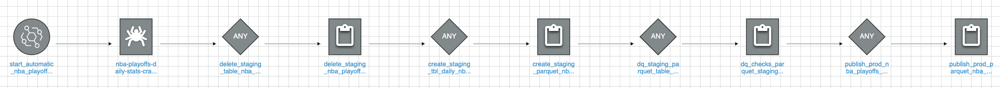
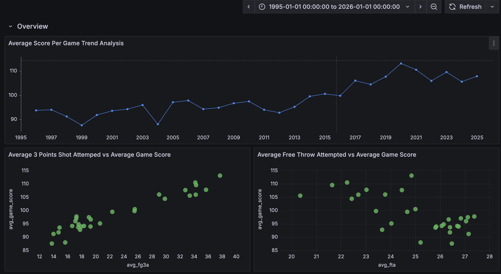
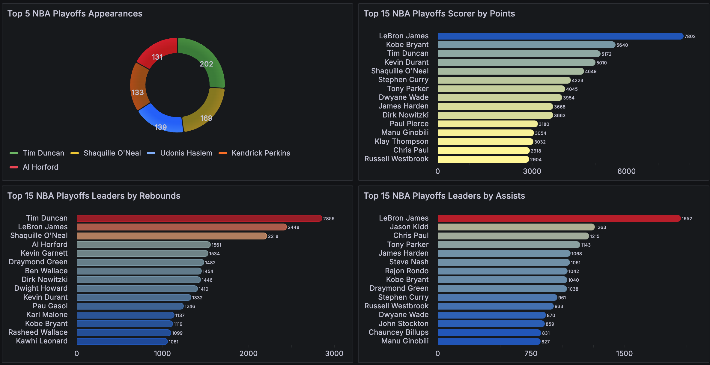
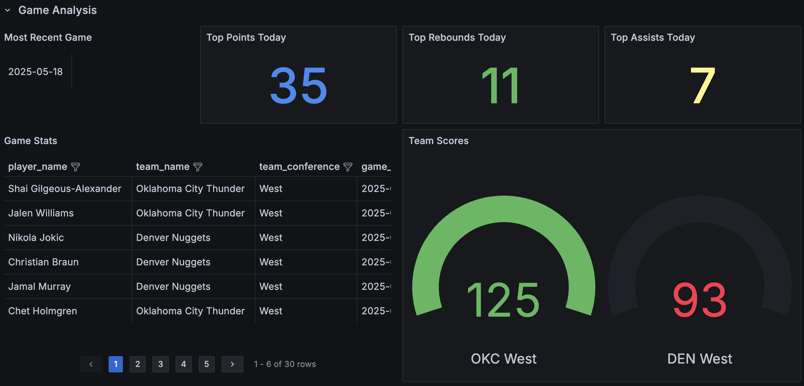

# NBA Playoffs Data Pipeline (Serverless AWS)

This project implements a **serverless data engineering pipeline** on AWS, ingesting, transforming, and visualizing NBA Playoffs player, team, and game stats. It demonstrates end-to-end data automation - from real-time ingestion with Lambda and Firehose, to transformation with Glue, and analysis in Athena and Grafana.

---

## Table of Contents

- [Architecture Overview](#architecture-overview)
- [Data Ingestion](#data-ingestion)
- [Data Transformation](#data-transformation)
- [Data Visualization](#data-visualization)
- [Event-Driven ETL Workflow Orchestration](#Event-Driven-ETL-Workflow-Orchestration)
- [Analysis & Observations](#analysis--observations)
- [Troubleshooting & Testing](#troubleshooting--testing)
- [Design Considerations](#design-considerations)
- [Future Improvements](#future-improvements)

---

## Architecture Overview

**Key AWS Services:**
- **API Source:** [Balldontlie NBA API](https://www.balldontlie.io/)
- **Ingestion:** AWS Lambda, Kinesis Firehose, S3
- **Orchestration:** EventBridge, Glue Workflows
- **ETL/Transformation:** AWS Glue Crawlers, Glue Jobs, Glue Data Catalog
- **Analytics:** Amazon Athena
- **Visualization:** Grafana
- **Monitoring:** CloudWatch Logs

---

## Data Ingestion

- **Historical Backfill Lambda:**  
  Extracts all NBA Playoffs player stats from 1995 up to the most current day. The data is saved as a bulk historical dataset in the S3 bucket:  
  - `nba-playoffs-historical-bucket`
- **Daily Ingestion Lambda:**  
  Runs automatically each day during the NBA Playoffs. If there are games on that day, it fetches the player stats and sends the data into Kinesis Data Firehose, which then delivers the records to the S3 bucket:  
  - `nba-playoffs-daily-stats-bucket`
- **Kinesis Data Firehose:**  
  Handles real-time streaming and delivery of daily stats from the Lambda function to S3.
- **EventBridge:**  
  Schedules and triggers the daily Lambda function to ensure data is ingested only when new games are played.
- **S3 Buckets:**  
  Act as the raw data landing zones for both historical and daily NBA Playoffs stats, partitioned and organized for downstream processing.

---

## Data Transformation

- **Glue Crawlers:** Detect and catalog new raw data files in S3, updating the Athena schema.
- **Glue Jobs:** Python ETL jobs:
  - Clean, normalize, and transform raw API JSON to flat, analytics-ready tables (Parquet format).
  - Partition by year/month for efficient querying.
  - Implement data quality checks (e.g., NULL checks, type casts).
  - Use a **staging table** pattern to only process new daily data before appending to the "prod" table.
- **Glue Workflows:** Orchestrate the ETL pipeline: Crawler → Staging → DQ → Prod Table.

---

## Data Visualization

- **Athena:** Query and analyze cleaned NBA stats (player, team, game metrics).
- **Grafana:** Visualize key metrics—e.g., team scoring trends, player performance, conference comparisons - using Athena as a data source.

---

## Event-Driven ETL Workflow Orchestration

This project utilizes an automated, event-driven ETL pipeline to process NBA Playoffs player stats as soon as new daily data lands in the `nba-playoffs-daily-stats-bucket` S3 bucket. The workflow is orchestrated using AWS Glue workflows and consists of the following sequence:

1. **Trigger:**  
   The workflow is triggered automatically whenever new files are created in the `nba-playoffs-daily-stats-bucket` (via Kinesis Firehose after Lambda ingestion).
2. **Crawl Raw Data:**  
   - **Glue Crawler** scans the bucket, cataloging new files and updating the Glue Data Catalog with any new schema changes.
3. **Delete Staging Table:**  
   - Existing staging tables and their data in the S3 bucket are dropped to ensure that only the new batch (previous 24 hours) is processed in the next steps.
4. **Create Staging Table:**  
   - New data from the daily raw bucket is loaded and transformed into a staging Parquet table, ready for validation.
5. **Data Quality Checks:**  
   - Automated scripts run data quality (DQ) checks on the new staging table, validating fields like player name, team abbreviation, game date, and points to ensure there are no missing, null, or duplicated values.
6. **Publish to Prod Table:**  
   - If all data quality checks pass, the new batch of daily data is **appended** to the production Parquet table (`final_nba_playoffs_data_parquet_tbl_prod` table).
7. **Workflow Monitoring:**  
   - Each job step is monitored via AWS CloudWatch and Glue triggers. If a step fails, subsequent steps do not run.

This event-driven ETL architecture ensures timely, reliable, and scalable processing of NBA Playoffs stats with minimal manual intervention.

---

## Analysis & Observations

### Key Insights from 30 Years of NBA Playoffs Data (1995–2025)

#### 📈 Long-Term Scoring Trends
- **Rising Points per Game:**
  Over the last 30 years, the average points scored per game in the NBA Playoffs has noticeably increased.
- **Three-Point Revolution:**  
  The main driver appears to be the increased number of 3-point attempts per game, as indicated by the strong correlation between `avg_fg3a` (average 3-pointers attempted) and `avg_game_score` in the visualizations.
- **Free Throw Attempts:**  
  No significant trend or relationship was observed between free throw attempts and average game score. Contrary to some expectations, selling fouls (“drawing fouls”) has **not** increased on average — the number of fouls per season has remained quite stable.

#### 🏆 Playoff Legends & Player Achievements
- **Playoff Appearance Leaders:**  
  Tim Duncan leads the NBA Playoffs in total appearances (202), followed by Shaquille O’Neal, Udonis Haslem, Kendrick Perkins, and Al Horford. Their longevity and consistency highlight both personal excellence and team success.
- **All-Around Greatness:**  
  LeBron James stands out as the all-time Playoff leader in points and assists, and ranks second in rebounds over the past 30 years. His ability to contribute across all facets of the game is unmatched.

#### 🔎 Daily Game Analysis
- **Real-Time Insights:**  
  The dashboard provides daily breakdowns of the most recent games, showing top performers for points, rebounds, and assists, along with full box scores for every player. Team scores and results (as seen in the daily panel) let users instantly identify the winner of each playoff game.

#### 📊 Further Observations & Thoughts
- **Assists and Team Success:**  
  High-assist players like Jason Kidd, Chris Paul, and Tony Parker consistently appear among leaders, suggesting the importance of playmaking in playoff success.
- **No Single-Factor Dominance:**  
  While 3-point shooting is a clear factor in rising scores, there is no evidence that any single metric (e.g., free throws, fouls) alone explains team success or changing trends.
- **Era Evolution:**  
  The visual uptick in scoring and shot attempts post-2015 matches the NBA’s well-documented shift toward pace-and-space, emphasizing 3-point shooting and faster offense.

---

## Troubleshooting & Testing

- **CloudWatch Logs:** Monitors Lambda & Glue job executions, error tracking.
- **Glue Job Debugging:** Includes test cases for ETL logic and schema validation.
- **SQL Testing:** Validated Athena queries against sample data before deployment.

---

## Design Considerations

- **Event-driven, serverless:** Entire pipeline scales with data volume, no servers to manage.
- **IAM Security:** Roles limited by least privilege for Lambda, S3, Firehose, Glue, Athena.
- **Partitioning:** Year/month partitions optimize Athena cost/performance.
- **Incremental Loads:** New daily snapshots processed without re-ingesting history data every time.

---

## Future Improvements

- **Incorporate NBA Regular Season Data:** Extend the pipeline to ingest and analyze both regular season and playoffs data for a more holistic view of team and player performance.
- **Dimensional Modeling:** Implement dimensional modeling by introducing more dimension tables (e.g., teams, players, games, seasons) and optimizing schema normalization to improve query performance and analytical flexibility.
- **Enhanced Data Quality Checks:** Expand data validation rules—such as referential integrity checks, range validations, and checks for duplicate records—to further guarantee data reliability and consistency throughout the pipeline.
- **Advanced Analytics:** Develop new features such as win prediction models, player impact scores, and advanced player/team rankings.
- **Orchestration Flexibility:** Experiment with different orchestration tools (e.g., Apache Airflow, AWS Step Functions) to further automate and optimize ETL workflows.
- **Automated Dashboard Updates and Monitoring:** Automate dashboard refreshes and add email or SNS alerts for pipeline failures or anomalies.
- **CI/CD Integration:** Integrate continuous integration/continuous deployment practices using tools like AWS CDK or Terraform for seamless deployment and versioning.
- **Pipeline Packaging:** Package the entire solution for easy deployment and reuse (e.g., AWS CloudFormation, AWS SAM, or Docker).
